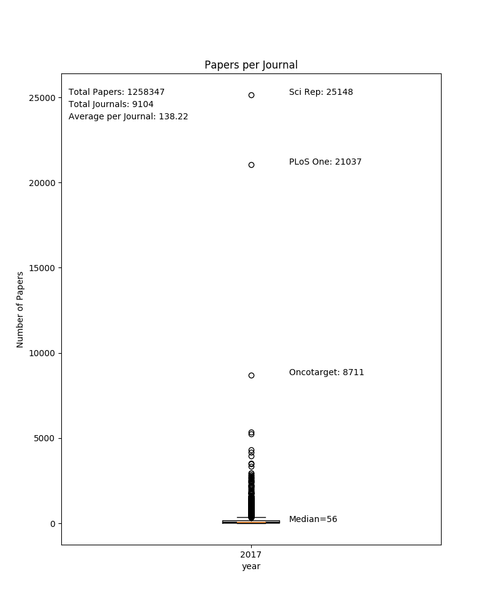
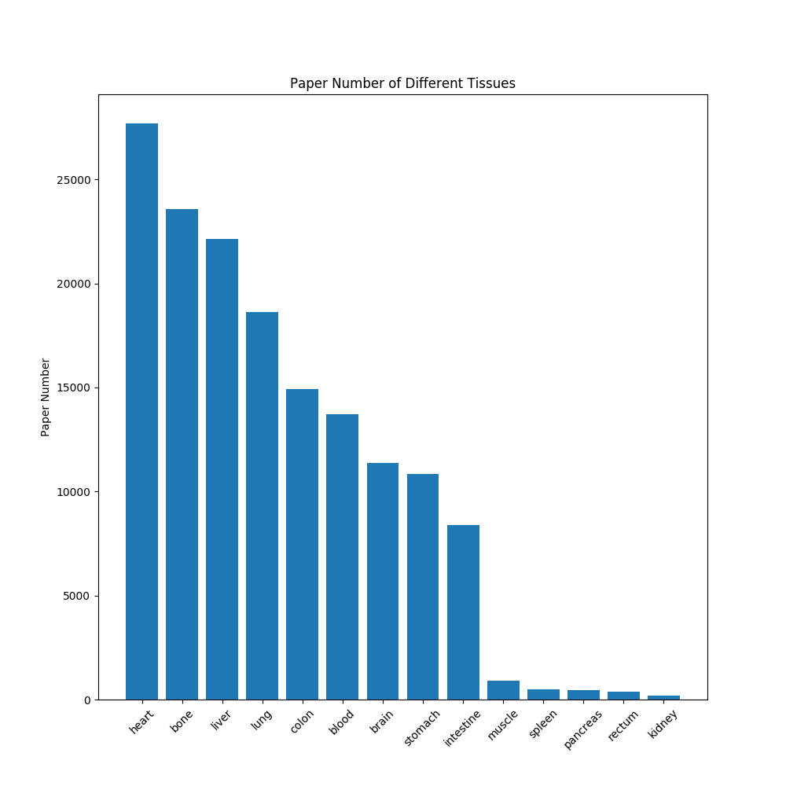
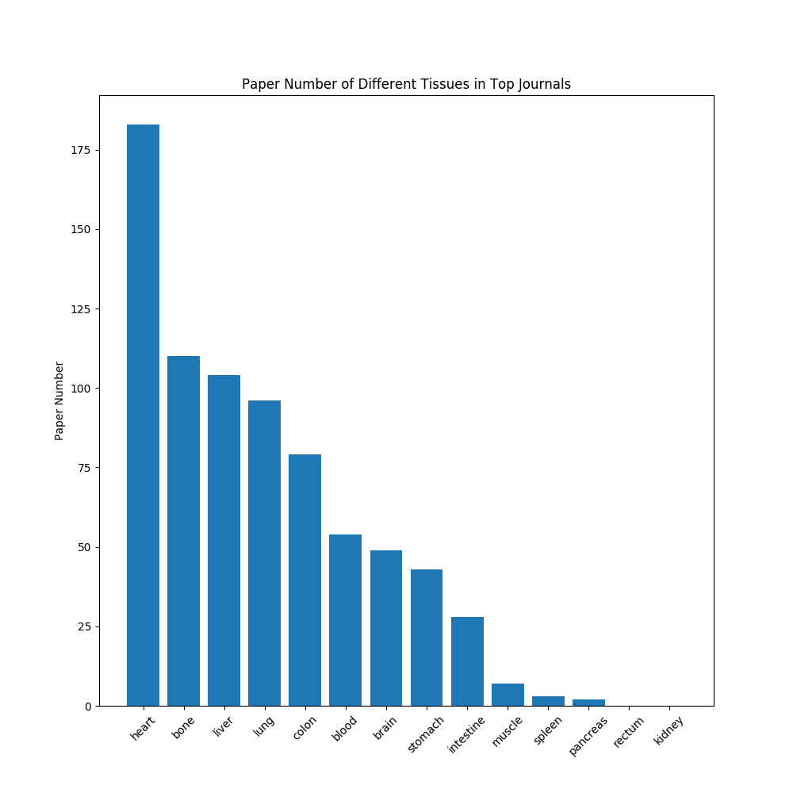
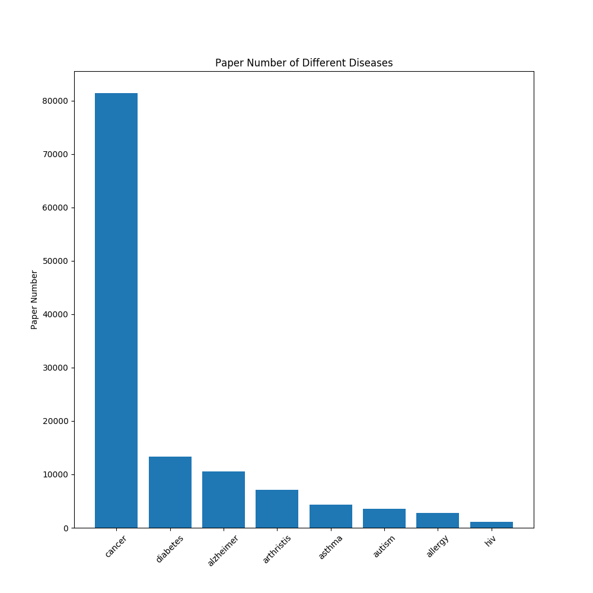
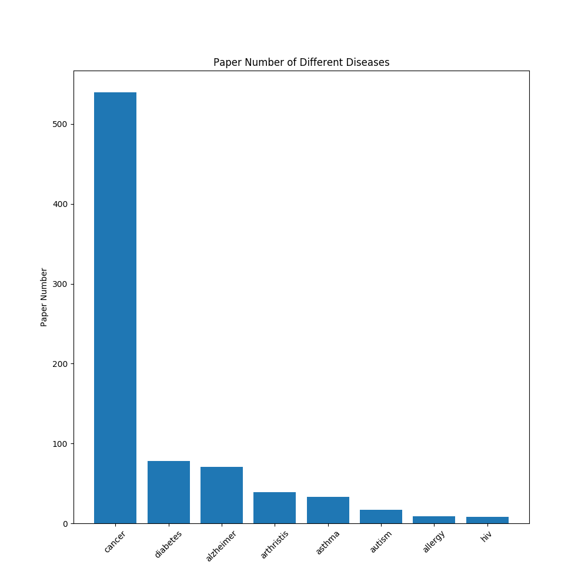
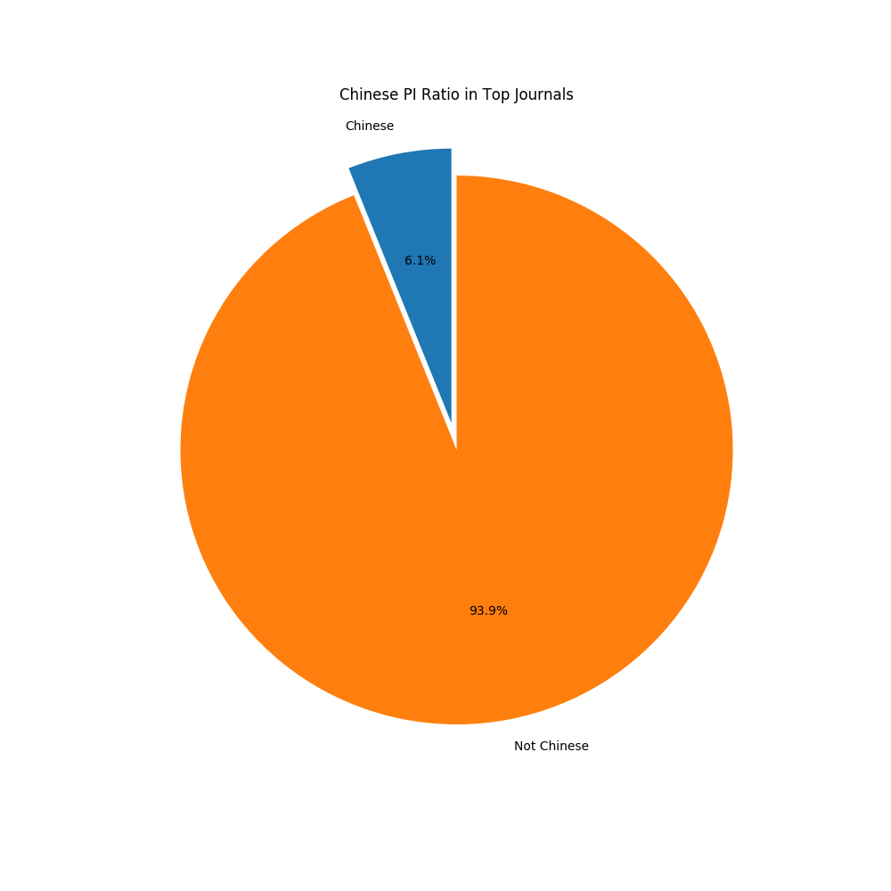
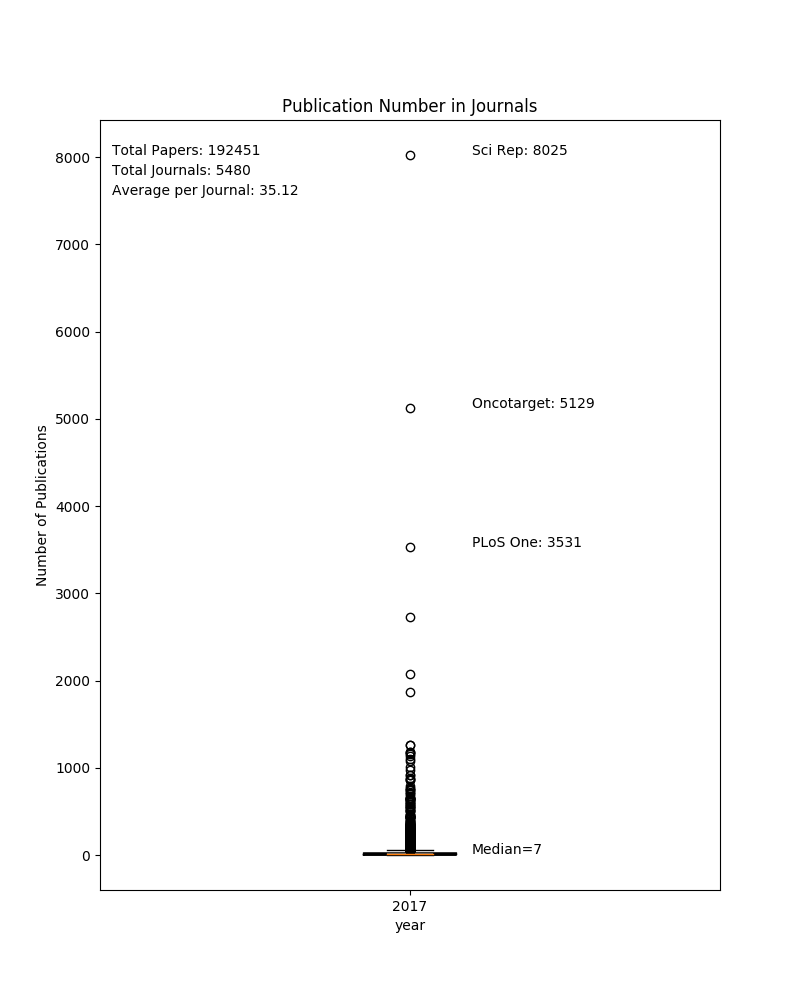
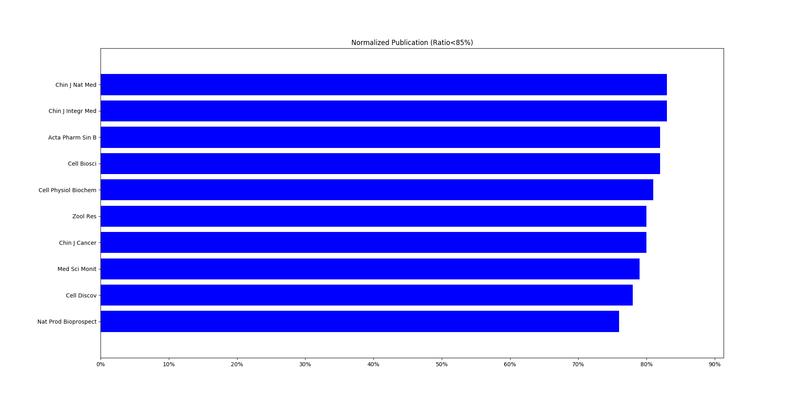
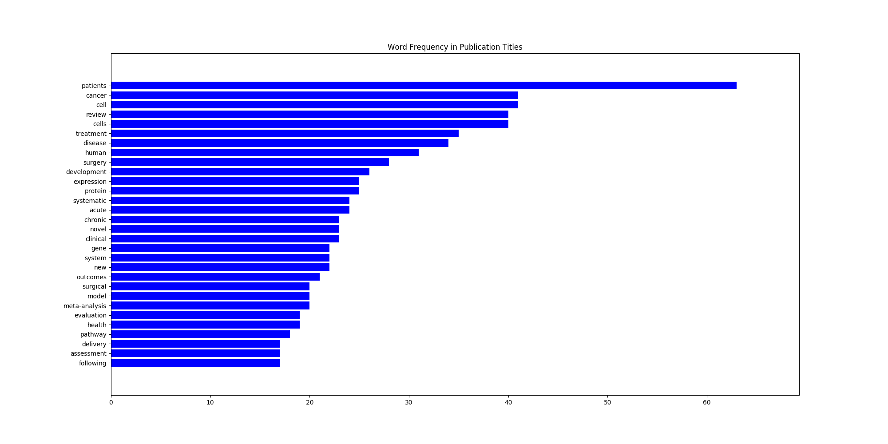

## Analyze Pubmed Records  

* ### Download Data from Pubmed
download publication records from 2017-01-01 to 2017-12-31 (publication date) as csv file.   

* ### Raw Data (2017.csv)
Raw csv file has 1292498 rows.  

* ### Clean the Data  
 1. Remove multiple headers;
 2. Strip 'Title';
 3. Remove null in 'Description';
 4. Remove duplicates.

* ### Count Publications in Each Journal  
  

* ### Check Studies Related to Different Tissues Based on Publication Title in All Journals

* ### Check Studies Related to Different Tissues Based on Publication Title in Top Journals (IF>20)  

* ### Check Studies Related to Different Diseases Based on Publication Title in All Journals    

* ### Check Studies Related to Different Diseases Based on Publication Title in Top Journals (IF>20) 

* ### Chinese PI Publication Ratio in All Journals 

* ### Chinese PI Publication Ratio in Top Journals (IF>20)  

* ### Journals Published Most Studies from Chinese PI  

* ### Journals Published Most Studies from Chinese PI (Normalized, and Ratio<85%)  

* ### Most Frequent Words Appears in Publication Titles (use 1000 records, and filtered with words blacklist)  

